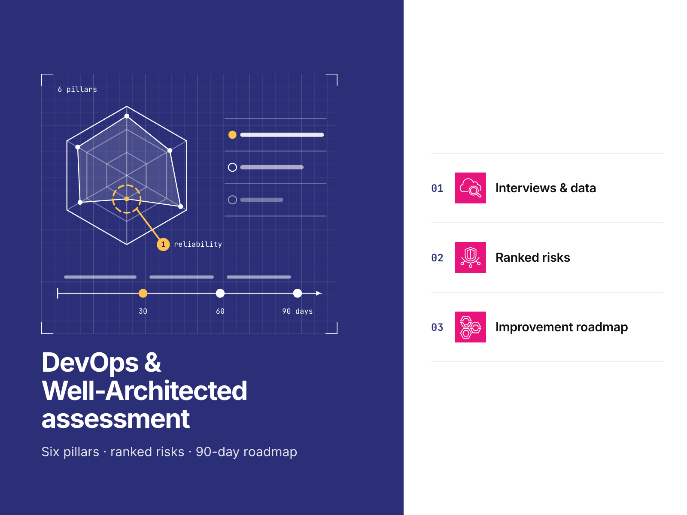
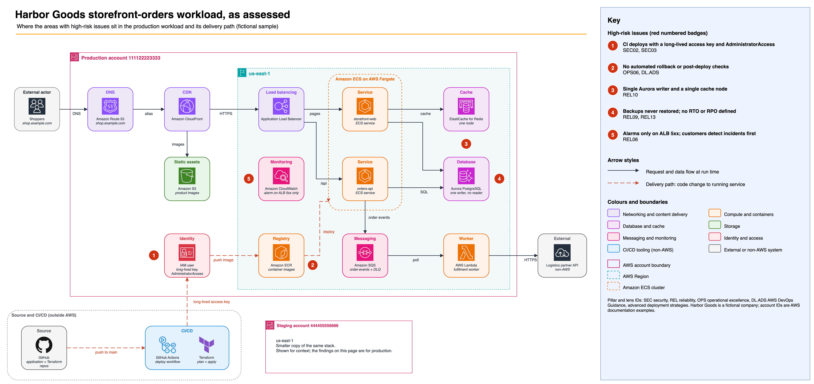
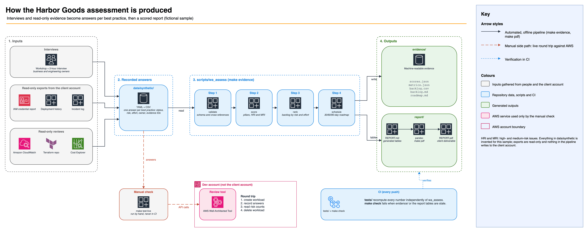

# AWS Well-Architected and DevOps assessment sample

An assessment deliverable for one workload: scored answers across the six pillars and the DevOps lens, a
risk-rated backlog, a 30/60/90-day roadmap and a client report, all generated from data and checked by tests.

[](https://github.com/gamaware/aws-well-architected-assessment-sample/actions/workflows/ci.yml)
[](LICENSE)




> **Fictional sample.** Harbor Goods and all data here are fictional. Each repository in this portfolio is a
> separate engagement with Harbor Goods, a fictional mid-size retailer. Account IDs are AWS documentation examples.

## Executive summary

Harbor Goods, a fictional mid-size retailer, asked for a review of `storefront-orders`, the workload behind its
online store. The team deploys several times a week, and recovery from a bad release is slow. Releases reach
every user at once, nothing checks them after they land, CI deploys with a long-lived administrator key, and nobody
has restored the orders database from a backup.

<!-- BEGIN GENERATED: headline -->

58 best practices reviewed, 49 gaps: 9 high, 27 medium and 13 low. Risk counts once per question, so the 9 high-rated
gaps across 8 questions make 8 high-risk issues (HRI; 7 in the framework, 1 in the DevOps lens), plus 21 medium-risk
issues (MRI). Well-Architected score 39%, DevOps lens score 38%.

<!-- END GENERATED: headline -->

Top three recommendations, in backlog order:

<!-- BEGIN GENERATED: top-recommendations -->

1. **Plan for unsuccessful changes** (OPS06-BP01, High risk, effort S). Add a rollback section to the pull request
   template, require backward-compatible (expand and contract) schema changes, and keep the previous task definition
   revision ready to redeploy.
2. **Use temporary credentials** (SEC02-BP02, High risk, effort S). Replace the ci-deployer key with GitHub OIDC
   federation to an IAM role scoped to the repository and the production environment, then deactivate and delete the
   key.
3. **Perform periodic recovery of the data to verify backup integrity and processes** (REL09-BP04, High risk, effort S).
   Restore the latest snapshot into the staging account every quarter, time it, check row counts, and record the result
   next to the recovery runbook.

<!-- END GENERATED: top-recommendations -->

The sample demonstrates:

- A review against the six AWS Well-Architected pillars and the DevOps lens, with best-practice IDs and titles
  as AWS publishes them (`OPS06-BP01`, `[DL.ADS.2]`).
- Findings traced to evidence: interviews, read-only exports and reviews, each with an ID the report cites.
- Scoring, high-risk and medium-risk issue counts, backlog ranking and roadmap scheduling from written rules
  ([assessment method](docs/methodology.md), [ADRs](docs/adr/README.md)).
- A report in which the scripts regenerate every number from the data and an independent test implementation
  recomputes it.

## Inspect the deliverable

| Artifact | Contents |
| --- | --- |
| [`report/REPORT.md`](report/REPORT.md) | The client report: executive summary, scores, findings by pillar, backlog, roadmap, evidence register |
| [`report/REPORT.pdf`](report/REPORT.pdf) | The same report as the client receives it |
| [`evidence/backlog.csv`](evidence/backlog.csv) | Risk-rated backlog ready to import into a tracker |
| [`evidence/roadmap.md`](evidence/roadmap.md) | The 30/60/90-day plan with dependencies |
| [`data/synthetic/answers/`](data/synthetic/answers/) | The recorded answers, one file per pillar plus the DevOps lens |
| [`docs/methodology.md`](docs/methodology.md) | How an assessment runs: interviews, evidence, the Well-Architected Tool, the DevOps lens |

## Scenario and acceptance criteria

Harbor Goods sells home and outdoor goods online and in stores. Its storefront, order API and fulfilment worker run
on Amazon ECS on AWS Fargate, Amazon Aurora PostgreSQL, Amazon ElastiCache, Amazon SQS and AWS Lambda, deployed by
GitHub Actions and Terraform. The head of engineering wants to know which risks to fix first before the peak season.

Constraints: one workload, read-only access for infrastructure inspection, a two-hour interview, a 90-day observation
window, and no changes to the client's infrastructure.

The client accepts the deliverable when:

- every best practice in scope has a status and at least one evidence ID;
- every gap has a risk rating, an effort estimate, an owner and a recommendation;
- the backlog follows risk order, and no roadmap item comes before the work it depends on;
- one command (`make verify`) reproduces every number in the report from the data.

## Architecture





The context view shows the workload as assessed. Shoppers reach the storefront through Route 53, CloudFront and an
Application Load Balancer. Two ECS services use Aurora and ElastiCache, and paid orders flow through SQS to a Lambda
worker that calls the logistics partner. Red badges mark the areas with high-risk issues: the CI deploy key, the
missing automated rollback, the single database writer and cache node, the untested backups, and alarm coverage.



The second view shows how the scripts produce the deliverable. Interview notes and read-only evidence become one answer
per best practice in `data/synthetic/`. `scripts/wa_assess` validates the answers, scores them, ranks the backlog and
schedules the roadmap, then writes `evidence/` and the tables in the report. Sources for both diagrams are in
[`docs/diagrams/`](docs/diagrams/).

## Verify locally

Prerequisites: [uv](https://docs.astral.sh/uv/) 0.12 or later (CI pins 0.12.19; it installs Python 3.13 and the
pinned packages from `uv.lock`) and GNU Make. `make pdf` also needs Docker; it runs the same pinned pandoc LaTeX
image as CI.

```bash
make setup    # install the pinned toolchain into .venv
make verify   # ruff, tests, and a check that evidence/ and the report match the data
```

Expected output ends with:

```text
ok: 7 outputs match data/synthetic
verify: all checks passed
```

The first run takes under a minute while uv downloads packages; later runs take about five seconds. The build
needs no AWS account.

Other targets: `make evidence` regenerates `evidence/` and the report tables after a data change, and `make pdf`
renders `report/REPORT.pdf`.

### Live check (optional, manual)

`make test-live` records the framework answers in the AWS Well-Architected Tool and prints the Tool's risk counts
next to the report's. It uses the maintainer's `dev` profile only, shows the caller identity and asks before it
starts, tags the workload `purpose=portfolio-test`, deletes it on exit, and confirms nothing tagged remains. Its
output goes to `live-output/`, which is never committed. CI never runs it.

## Repository map

```text
data/synthetic/        Fictional inputs: workload, evidence register, answers per pillar, CSV exports
scripts/wa_assess/     Validate, score, rank, schedule and render (python -m wa_assess generate|check)
scripts/live/          Manual Well-Architected Tool round trip (make test-live)
evidence/              Generated: scores, delivery metrics, backlog (CSV and Markdown), roadmap
report/                REPORT.md (canonical), REPORT.pdf (generated)
tests/                 Rule tests, an independent reference implementation, offline test of the live script
docs/methodology.md    How the assessment is run
docs/adr/              Decision records
docs/diagrams/         Diagram sources (.drawio) and exports (.png)
docs/assets/           Cover, social preview (spec, illustration, rendered PNG)
```

## Decisions and trade-offs

Architecture decision records follow the *Fundamentals of Software Architecture* (2nd ed.) format.

| Number | Title | Status |
| --- | --- | --- |
| [0001](docs/adr/0001-answers-as-data-report-tables-generated.md) | Record answers as data and generate the report tables from them | Accepted |
| [0002](docs/adr/0002-partial-credit-and-risk-per-question.md) | Score with partial credit and count risks per question | Accepted |
| [0003](docs/adr/0003-backlog-ranking-and-roadmap-buckets.md) | Rank the backlog by risk and effort, and pull dependencies forward on the roadmap | Accepted |
| [0004](docs/adr/0004-offline-verification-manual-live-round-trip.md) | Verify offline in CI and keep the Well-Architected Tool round trip manual | Accepted |
| [0005](docs/adr/0005-pdf-with-shared-pandoc-image.md) | Render the PDF with the shared pandoc LaTeX image | Accepted |

## Security and quality gates

| Gate | Where | Why |
| --- | --- | --- |
| `make verify` | CI and locally | The same command proves the report numbers follow from the data |
| PDF build and evidence rerun | CI (shared `report`) | The report must render, and `make evidence` must reproduce `evidence/` |
| markdownlint, link check, prose lint | CI (shared `lint-docs`) | The report and docs are the product |
| actionlint, zizmor | CI (shared `lint-actions`) and pre-commit | Workflows keep narrow token access and pinned actions |
| gitleaks, detect-secrets | CI (shared `secrets`) and pre-commit | No credentials in a public repository |
| Semgrep, Trivy, Checkov | CI (shared `security`) | Code and configuration scanning |
| Account ID test | `tests/test_report.py` | Only AWS documentation example account IDs may appear |

Workflows start from `permissions: {}`, pin actions to full commit SHAs, and never receive cloud credentials.

## Limits and production adaptations

- Harbor Goods, its people, accounts, incidents and exports are fictional. The findings show the format and the
  reasoning, not the state of any real system.
- The DevOps lens findings sample all five sagas of the DevOps Guidance but not every capability in each. A full
  engagement walks through every capability that applies to the workload.
- The offline checks prove the report is consistent with its data. They cannot prove the data describes a real
  workload; in an engagement that proof is the evidence itself and the client's review of the findings.
- In a real engagement the client records the answers in the AWS Well-Architected Tool in its own account, or grants
  separately scoped Tool write access; the review saves a milestone and returns after the first 90 days to re-review
  the high risks.

## Related work

Part of the [AWS DevOps portfolio](https://github.com/gamaware/aws-devops-portfolio); it backs the "DevOps and
Well-Architected assessment" service:
[DevOps and Well-Architected assessment on Upwork](https://www.upwork.com/freelancers/~014b3520cf9e140103). The
method is the one Alex uses in audits for ITESO and freelance clients in Guadalajara. Contribution, conduct and
support guidelines come from [gamaware/.github](https://github.com/gamaware/.github); see also
[SECURITY.md](SECURITY.md) and [CHANGELOG.md](CHANGELOG.md).

## License

[MIT](LICENSE)
